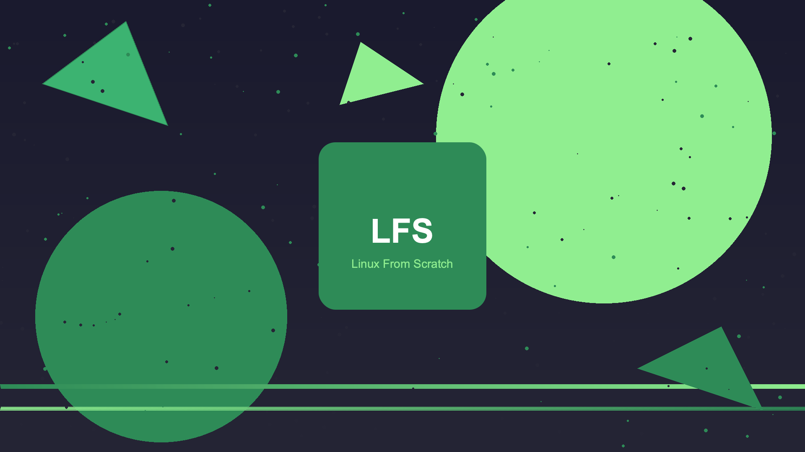

# LFS/BLFS Builder - Custom Linux Distribution Builder

[](https://github.com/lfs-builder/lfs-builder)
[](LICENSE)
[]()
[]()
[]()

A complete set of scripts to build a custom Linux From Scratch distribution with desktop environment, audio production tools, multiple init systems, and capable of creating bootable USB installers from macOS, Linux, or Windows.

## Table of Contents

- [Overview](#overview)
- [Features](#features)
- [Build Profiles](#build-profiles)
- [System Requirements](#system-requirements)
- [Quick Start](#quick-start)
- [Installation](#installation)
- [Usage Guide](#usage-guide)
- [Configuration](#configuration)
- [Build Profiles Details](#build-profiles-details)
- [Audio Production](#audio-production)
- [Init Systems](#init-systems)
- [Live USB System](#live-usb-system)
- [Package Manager (LPM)](#package-manager-lpm)
- [System Updater](#system-updater)
- [Security Features](#security-features)
- [Network Stack](#network-stack)
- [Cross-Compilation](#cross-compilation)
- [Troubleshooting](#troubleshooting)
- [Directory Structure](#directory-structure)
- [Contributing](#contributing)
- [License](#license)

## Overview

LFS/BLFS Builder is an automated toolchain that builds a complete Linux distribution from source code using the Linux From Scratch (LFS) and Beyond Linux From Scratch (BLFS) methodologies. It creates bootable ISO images with live system capability, multiple desktop environments, professional audio production tools, flexible init systems (sysvinit/systemd), development tools, and security hardening.

## Features

### Core Features
- ✅ Complete LFS 13.0 + BLFS 13.0 build system
- ✅ Live USB "Try before install" capability
- ✅ Automated installer with disk partitioning
- ✅ Cross-platform support (Linux, macOS via Docker, Windows via WSL2)
- ✅ Multiple init systems (sysvinit, systemd, OpenRC, runit, s6) with unified `svc` command

### Audio Production (NEW in 4.2.0)
- 🎵 **CLI Audio Profile** - Headless, low-latency audio production
- 🎚️ **Studio Profile** - Full XFCE desktop with professional DAWs
- 🔥 **Real-time Kernel** - PREEMPT_RT for ultra-low latency
- 🎹 **DAWs**: Ardour 8.12.0, LMMS 1.2.2, Audacity 3.8.2
- 🎧 **MIDI Tools**: FluidSynth 2.5.0, TiMidity++ 2.15.0, LinuxSampler 2.3.0
- 🔊 **Audio Servers**: JACK2, PipeWire, ALSA
- 🎛️ **Plugins**: Calf Studio Gear, LSP Plugins, Dragonfly Reverb
- 🎼 **SoundFonts**: FluidR3 GM/GS, Timidity Freepats
- 🖥️ **GUI Tools**: QjackCtl 1.0.1, Patchage 1.0.12, Qpwgraph 1.8.0

### Desktop Environments
- 🖥️ **XFCE 4.20** - Lightweight, fast desktop
- 🖥️ **GNOME 46** - Modern, feature-rich desktop
- 🖥️ **KDE Plasma 6.2** - Full-featured, customizable desktop
- 🖥️ **LXQt 2.1.0** - Extremely lightweight Qt desktop
- 🖥️ **Minimal** - Command-line only (servers/embedded)

### Network Stack (NEW in 4.2.0)
- 🌐 **Web Browsers**: Firefox 128.8.0esr, Brave 1.76.82, Chromium 133.0.6943.98
- 📧 **Email Clients**: Thunderbird 140.8.0esr, Claws Mail 4.3.0, Mutt 2.2.15
- 🖥️ **Terminal Browsers**: Lynx 2.9.2, Links 2.30, w3m 0.5.3
- 📥 **Download Managers**: Wget2 2.2.0, Aria2 1.37.0
- 🔧 **Network Configuration**: DHCP/static, DNS, Wi-Fi, proxy settings
- 🚀 **Performance**: TCP BBR congestion control

### Development Tools
- ☕ **Java Development** - OpenJDK 21.0.10, Maven 3.9.9, Gradle 8.15
- 🐳 **Container Support** - Docker 28.3.3, Kubernetes 1.32.4, Podman
- 📦 **Package Manager** - LPM (LFS Package Manager) with upgrade support
- 🔄 **System Updater** - `lfs-update` for system updates and rollbacks

### Security & Privacy
- 🛡️ **Security Hardening** - Kernel hardening, firewall, fail2ban, auditd
- 🔒 **Privacy Tools** - DNSCrypt, WireGuard, Tor, telemetry blocking
- 📊 **Monitoring** - Prometheus, Node Exporter, Netdata, AIDE
- 💾 **Encryption** - Encrypted swap, LUKS support

### Cross-Platform & Embedded
- 📱 **ARM64 Support** - Raspberry Pi, Orange Pi, Pine64
- 🔄 **Cross-Compilation** - Build for ARM64 from x86_64
- 🚀 **U-Boot Integration** - Bootloader support for SBCs

## Build Profiles

| Profile | Desktop | Size | Build Time | RAM | Init System | Use Case |
|---------|---------|------|------------|-----|-------------|----------|
| **minimal** | None | 1GB | 2h | 256MB | sysvinit | Servers, embedded |
| **xfce** | XFCE | 4GB | 4h | 600MB | systemd | Lightweight desktop |
| **lxqt** | LXQt | 2GB | 3h | 500MB | systemd | Very lightweight |
| **gnome** | GNOME | 8GB | 8h | 1.5GB | systemd | Modern desktop |
| **kde** | KDE Plasma | 10GB | 12h | 1.8GB | systemd | Full-featured desktop |
| **java-dev** | XFCE | 10GB | 6h | 2GB | systemd | Java development |
| **server** | None | 2GB | 3h | 256MB | sysvinit | Production server |
| **secure** | XFCE | 6GB | 5h | 800MB | sysvinit | Security-focused |
| **full** | GNOME | 20GB | 12h | 2GB | systemd | Complete system |
| **arm64** | None | 2GB | 3h | 256MB | sysvinit | ARM64 SBCs |
| **audio-cli** | None | 2GB | 3h | 512MB | sysvinit | Headless audio production |
| **audio-studio** | XFCE | 8GB | 6h | 1GB | systemd | Audio production studio |
| **custom** | User-defined | Variable | Variable | Variable | User-choice | Custom builds |

## System Requirements

### Linux (Native Build)
| Requirement | Minimal | Recommended |
|-------------|---------|-------------|
| **Disk Space** | 50GB | 100GB |
| **RAM** | 8GB | 16GB |
| **CPU Cores** | 4 | 8+ |
| **OS** | Ubuntu 22.04+ | Ubuntu 24.04+ |
| **Architecture** | x86_64 | x86_64 / ARM64 |

### macOS (Docker Build)
| Requirement | Minimal | Recommended |
|-------------|---------|-------------|
| **Disk Space** | 60GB | 100GB |
| **RAM** | 8GB | 16GB |
| **CPU Cores** | 4 | 8+ |
| **Docker** | 24.0+ | Latest |
| **Architecture** | Intel / Apple Silicon | Apple Silicon |

### Windows (WSL2)
| Requirement | Minimal | Recommended |
|-------------|---------|-------------|
| **Disk Space** | 60GB | 100GB |
| **RAM** | 8GB | 16GB |
| **WSL2** | Ubuntu 22.04 | Ubuntu 24.04 |
| **Windows** | Windows 10 2004+ | Windows 11 |

## Quick Start

```bash
# Clone the repository
git clone https://github.com/lfs-builder/lfs-builder.git
cd lfs-builder

# List all available profiles
python3 builder.py --list-profiles

# Build with default profile (XFCE + Live USB)
python3 builder.py

# Build with specific profile
python3 builder.py --profile kde --output ./lfs-kde
python3 builder.py --profile java-dev --output ./lfs-java
python3 builder.py --profile server --output ./lfs-server

# Build for audio production
python3 builder.py --profile audio-studio           # Full studio with XFCE + systemd
python3 builder.py --profile audio-cli --init sysvinit  # Headless + sysvinit

# Choose init system
python3 builder.py --profile minimal --init sysvinit   # LFS classic
python3 builder.py --profile xfce --init systemd       # Modern desktop

# Build for ARM64 (Raspberry Pi)
python3 builder.py --profile arm64 --config config/build-cross.conf

# Write to USB (after build completes)
python3 builder.py --write-usb /dev/sdX

# Build with security hardening
python3 builder.py --profile secure

# Build full system
python3 builder.py --profile full --output ./lfs-full

# Resume from failed stage
python3 builder.py --resume-from desktop

# Show profile information
python3 builder.py --profile-info audio-studio
python3 builder.py --profile-info arm64

# Clean build directory
python3 builder.py --clean --output ./lfs-build

# Disable live system (server builds)
python3 builder.py --no-live --profile server
```

## Installation

### Linux (Native)

```bash
# Install dependencies
sudo apt update
sudo apt install -y build-essential bison flex gawk texinfo \
    wget curl git python3 python3-pip xorriso isolinux \
    mtools dosfstools parted rsync bc cpio kmod \
    libssl-dev libelf-dev

# Clone and build
git clone https://github.com/lfs-builder/lfs-builder.git
cd lfs-builder
python3 builder.py --profile xfce
```

---

### 🔹 Fedora / RHEL / CentOS (with `dnf`)

```bash
sudo dnf groupinstall -y "Development Tools"
sudo dnf install -y bison flex gawk texinfo wget curl git python3 python3-pip \
    xorriso isolinux mtools dosfstools parted rsync bc cpio kmod \
    openssl-devel elfutils-libelf-devel
```

> **Notes**:
> - `build-essential` is replaced by the `"Development Tools"` group.
> - `libssl-dev` → `openssl-devel`
> - `libelf-dev` → `elfutils-libelf-devel`
> - `isolinux` is part of the `syslinux` package (or `syslinux-tools`). If the command fails, try `syslinux` or `syslinux-tools`.

---

### 🔹 Arch Linux (with `pacman`)

```bash
sudo pacman -S --needed base-devel bison flex gawk texinfo wget curl git python python-pip \
    xorriso libisoburn mtools dosfstools parted rsync bc cpio kmod \
    openssl elfutils
```

> **Notes**:
> - `base-devel` includes `gcc`, `make`, etc.
> - `python` and `python-pip` are the Python packages.
> - `libisoburn` provides `xorriso`; you can install `xorriso` if available.
> - `openssl` and `elfutils` are development library equivalents (headers are included).

---

### 🔹 openSUSE (with `zypper`)

```bash
sudo zypper install -t pattern devel_basis
sudo zypper install -y bison flex gawk texinfo wget curl git python3 python3-pip \
    xorriso isolinux mtools dosfstools parted rsync bc cpio kmod \
    libopenssl-devel elfutils-devel
```

> **Notes**:
> - `devel_basis` is the equivalent of `build-essential`.
> - `libopenssl-devel` corresponds to `libssl-dev`.
> - `elfutils-devel` provides ELF headers.

---

### 🔹 Alpine Linux (with `apk`) – if needed

```bash
sudo apk add build-base bison flex gawk texinfo wget curl git python3 py3-pip \
    xorriso isolinux mtools dosfstools parted rsync bc cpio kmod \
    openssl-dev elfutils-dev
```

> `build-base` replaces `build-essential`, and development libraries have the `-dev` suffix.

---

### 🔹 Gentoo (with `emerge`) – for the adventurous

```bash
sudo emerge -av sys-devel/gcc sys-devel/binutils sys-devel/make sys-devel/bison \
    sys-devel/flex sys-devel/m4 sys-devel/gawk sys-devel/texinfo net-misc/wget \
    net-misc/curl dev-vcs/git dev-lang/python dev-python/pip app-cdr/xorriso \
    sys-boot/syslinux sys-fs/mtools sys-fs/dosfstools sys-block/parted net-misc/rsync \
    app-alternatives/bc sys-apps/cpio sys-apps/kmod dev-libs/openssl dev-libs/elfutils
```

---

### macOS (Docker) won't produce an iso file, only for testing pipeline

```bash
# Install Docker Desktop from https://www.docker.com/products/docker-desktop

# Clone and run
git clone https://github.com/lfs-builder/lfs-builder.git
cd lfs-builder
chmod +x mac-lfs-builder.sh
./mac-lfs-builder.sh
```

### Windows (WSL2)

```powershell
# In PowerShell as Administrator
wsl --install -d Ubuntu-22.04

# In WSL2 terminal
sudo apt update && sudo apt upgrade -y
sudo apt install -y build-essential bison flex gawk texinfo \
    wget curl git python3 xorriso isolinux parted rsync

git clone https://github.com/lfs-builder/lfs-builder.git
cd lfs-builder
python3 builder.py --profile xfce
```

## Usage Guide

### Basic Commands

```bash
# Build with default profile
python3 builder.py

# Build with specific profile and output directory
python3 builder.py --profile kde --output ./my-lfs-build

# Use custom configuration
python3 builder.py --config config/my-build.conf

# Resume from failed stage
python3 builder.py --resume-from configure-desktop

# Write ISO to USB
python3 builder.py --write-usb /dev/sdb

# Clean everything
python3 builder.py --clean --output ./lfs-build

# Verbose output
python3 builder.py --verbose
```

### Profile Management

```bash
# List all profiles
python3 builder.py --list-profiles

# Show profile details
python3 builder.py --profile-info secure
python3 builder.py --profile-info audio-studio
python3 builder.py --profile-info arm64

# Build with specific init system
python3 builder.py --profile minimal --init sysvinit
python3 builder.py --profile server --init openrc
python3 builder.py --profile audio-cli --init sysvinit

# Disable live system (faster server build)
python3 builder.py --profile server --no-live
```

### Configuration Selection

```bash
# Interactive configuration selector
./tools/config-selector.sh

# Copy specific configuration
cp config/build.conf.java config/build.conf
cp config/build-cross.conf config/build.conf
cp config/build.conf.minimal config/build.conf
```

## Configuration

### Main Configuration (`config/build.conf`)

```json
{
  "lfs_version": "13.0",
  "blfs_version": "13.0",
  "architecture": "x86_64",
  "target_triplet": "x86_64-lfs-linux-gnu",
  "build_threads": 8,

  "init_system": {
    "choice": "sysvinit",  // or systemd, openrc, runit, s6
    "service_style": "lfs-classic",  // or bsd-style
    "parallel_startup": false,
    "auto_restart": true,
    "default_runlevel": 3
  },

  "desktop": {
    "type": "xfce",
    "display_manager": "lightdm",
    "theme": "adwaita",
    "extras": ["firefox", "libreoffice", "gimp", "vlc"]
  },

  "security": {
    "kernel_hardening": true,
    "firewall": {"enabled": true, "allow_ssh": true},
    "fail2ban": {"enabled": true}
  },

  "users": [
    {"name": "lfsuser", "sudo": true, "autologin": true}
  ],

  "network": {
    "dhcp": true,
    "dns_servers": ["8.8.8.8", "1.1.1.1"],
    "enable_ipv6": true
  }
}
```

### Audio Profile Configuration (`config/audio-profile.conf`)

```json
{
  "audio_profile": "studio-full",  // or cli-minimal, desktop-xfce, desktop-gnome
  "rt_kernel": true,
  "sample_rate": 48000,
  "buffer_size": 128,
  "rt_priority": 95,
  "jack2_enabled": true,
  "pipewire_enabled": false,
  "soundfonts_level": "medium",
  "daws": ["ardour", "lmms", "audacity"],
  "plugins": ["calf", "lsp", "dragonfly-reverb"]
}
```

### Network Configuration (`config/network.conf`)

```bash
# Network interface configuration
PRIMARY_INTERFACE="eth0"
INTERFACE_CONFIG="dhcp"  # or static

# Static IP (if INTERFACE_CONFIG=static)
STATIC_IP="192.168.1.100"
STATIC_NETMASK="255.255.255.0"
STATIC_GATEWAY="192.168.1.1"
DNS_SERVERS="8.8.8.8 1.1.1.1"

# Wi-Fi (if applicable)
WIFI_ENABLED=false
WIFI_SSID=""
WIFI_PSK=""

# Proxy settings
HTTP_PROXY=""
HTTPS_PROXY=""
```

### Cross-Compilation Configuration (`config/build-cross.conf`)

```json
{
  "architecture": "aarch64",
  "target_triplet": "aarch64-lfs-linux-gnu",
  "cross_compile": true,
  "cross_prefix": "/usr/bin/aarch64-linux-gnu-",
  "qemu_user": "qemu-aarch64-static",
  
  "bootloader": {
    "type": "uboot",
    "uboot_board": "rpi_4"
  }
}
```

## Build Profiles Details

### XFCE Profile
Lightweight desktop perfect for older hardware or users who prefer speed.

```bash
python3 builder.py --profile xfce
```
- **Desktop**: XFCE 4.20
- **Panel**: Customizable with plugins
- **File Manager**: Thunar
- **Terminal**: XFCE Terminal
- **Memory**: ~600MB
- **Init System**: systemd

### GNOME Profile
Modern, polished desktop with extensive application suite.

```bash
python3 builder.py --profile gnome
```
- **Desktop**: GNOME 46
- **Display Manager**: GDM with Wayland
- **File Manager**: Nautilus
- **Terminal**: GNOME Terminal
- **Memory**: ~1.5GB
- **Init System**: systemd

### KDE Plasma Profile
Full-featured desktop with maximum customization.

```bash
python3 builder.py --profile kde
```
- **Desktop**: KDE Plasma 6.2
- **Display Manager**: SDDM
- **File Manager**: Dolphin
- **Terminal**: Konsole
- **Memory**: ~1.8GB
- **Build Time**: 8-12 hours
- **Init System**: systemd

### LXQt Profile
Extremely lightweight Qt-based desktop.

```bash
python3 builder.py --profile lxqt
```
- **Desktop**: LXQt 2.1.0
- **Window Manager**: Openbox
- **File Manager**: PCManFM-Qt
- **Terminal**: QTerminal
- **Memory**: ~500MB
- **Init System**: systemd

### Java Development Profile
Complete Java development environment.

```bash
python3 builder.py --profile java-dev
```
- **JDK**: OpenJDK 21.0.10 LTS
- **Build Tools**: Maven 3.9.9, Gradle 8.15
- **Servers**: Tomcat 10.1.39, Jenkins 2.500.1
- **Containers**: Docker 28.3.3, kubectl 1.32.4
- **Node.js**: 22.15.0 LTS
- **Init System**: systemd

### Server Profile
Production-optimized server configuration.

```bash
python3 builder.py --profile server
```
- **Kernel**: Optimized (TCP BBR, tuned sysctl)
- **Security**: Hardened SSH, firewall, fail2ban
- **Monitoring**: Prometheus node_exporter, Netdata
- **Logging**: Centralized rsyslog
- **Backup**: Automated daily backups
- **Init System**: sysvinit (LFS classic)

### Secure Profile
Security-hardened desktop with privacy tools.

```bash
python3 builder.py --profile secure
```
- **Hardening**: Kernel hardening, SELinux/AppArmor
- **Firewall**: nftables with default deny
- **Intrusion Detection**: AIDE, rkhunter, Lynis
- **Privacy**: DNSCrypt, WireGuard, Tor
- **Audit**: Full auditd configuration
- **Init System**: sysvinit

### ARM64 Profile
For Raspberry Pi and ARM64 single-board computers.

```bash
python3 builder.py --profile arm64 --config config/build-cross.conf
```
- **Architecture**: aarch64
- **Bootloader**: U-Boot
- **Boards**: Raspberry Pi 4/5, Orange Pi, Pine64
- **Output**: SD card image (.img)
- **Cross-Compile**: From x86_64 host
- **Init System**: sysvinit

## Audio Production

### Audio-CLI Profile (Headless)

Perfect for remote recording studios, batch processing, or embedded audio applications.

```bash
python3 builder.py --profile audio-cli --init sysvinit
```

**Features:**
- No X11/GUI - pure command-line
- Real-time kernel for low latency
- JACK2 audio server
- MIDI tools (FluidSynth, TiMidity++)
- CLI audio editors (SoX, Ecasound)
- LV2/LADSPA plugins
- SoundFont support

**Commands after installation:**
```bash
# Start audio system
start-audio

# Stop audio system
stop-audio

# List MIDI devices
midi-ls

# Play MIDI file
fluidsynth /usr/share/soundfonts/FluidR3_GM.sf2 song.mid
```

### Audio-Studio Profile

Complete professional audio production workstation with XFCE desktop.

```bash
python3 builder.py --profile audio-studio
```

**Features:**
- XFCE desktop optimized for audio work
- Ardour 8.12.0 (professional DAW)
- LMMS 1.2.2 (music production)
- Audacity 3.8.2 (audio editing)
- JACK2 with QjackCtl GUI
- Full LV2/LADSPA plugin suite
- FluidSynth with soundfonts
- Real-time kernel
- Low-latency system tuning

**Commands after installation:**
```bash
# Start JACK with GUI
qjackctl

# Launch Ardour
ardour

# Start MIDI synth
fluidsynth -a jack -g 0.5 /usr/share/soundfonts/FluidR3_GM.sf2
```

## Init Systems

### Unified Service Management (`svc` command)

The `svc` command works identically across all init systems:

```bash
# Start a service
svc start sshd

# Stop a service
svc stop tomcat

# Restart a service
svc restart network

# Check status
svc status docker

# Enable service on boot
svc enable nginx

# Disable service on boot
svc disable apache2

# List all services
svc list
```

### sysvinit (LFS Classic)

Traditional UNIX init system - simple, transparent, lightweight.

```bash
# Build with sysvinit
python3 builder.py --profile minimal --init sysvinit

# Boot script styles
SYSVINIT_STYLE="lfs-classic"  # Original LFS style
SYSVINIT_STYLE="bsd-style"    # BSD-style init

# Default runlevels
# 1: single-user, 3: multi-user, 5: X11
```

### systemd (Modern)

Modern init system with parallel boot, service management, and advanced features.

```bash
# Build with systemd
python3 builder.py --profile xfce --init systemd

# Enable services
systemctl enable docker
systemctl start nginx
```

## Live USB System

Your built ISO includes a complete live system:

### Boot Menu Options
1. **Try LFS Linux (Live mode)** - Boot in RAM, no disk writes
2. **Try LFS Linux (with Persistence)** - Save changes on USB
3. **Install LFS Linux** - Permanent installation
4. **Memory Test** - Diagnostic tool
5. **Rescue Mode** - System recovery

### Creating Persistence

```bash
# After writing ISO to USB, create persistence partition
sudo create-persistence.sh /dev/sdb 4096  # 4GB persistence

# With custom label
sudo create-persistence.sh -l MYSTORAGE /dev/sdc

# Remove persistence
sudo create-persistence.sh --remove /dev/sdb
```

## Package Manager (LPM)

LPM (LFS Package Manager) is included for package management.

### Basic Commands

```bash
# Update package database
lpm update

# Install packages
lpm install firefox
lpm install /path/to/package.lpm

# List installed packages
lpm list

# Search packages
lpm search "java"

# Remove packages
lpm remove firefox

# Create package from installed files
lpm create myapp 1.0.0
```

### Upgrade Commands

```bash
# List outdated packages
lpm list-outdated

# Upgrade single package
lpm upgrade firefox

# Upgrade all packages
lpm upgrade
```

## System Updater

`lfs-update` manages system updates and rollbacks.

### Commands

```bash
# Check for available updates
lfs-update check

# Show system status
lfs-update status

# Perform full system upgrade
lfs-update upgrade

# Rollback to previous state
lfs-update rollback

# Clean old backups
lfs-update clean
```

### Automatic Updates
- Daily update checks via cron or systemd timer
- Email notifications when updates available
- Automatic backup before upgrades
- Last 5 backups kept by default

## Security Features

### Kernel Hardening
- ASLR improvements
- Kernel pointer restriction
- BPF JIT hardening
- ptrace scope restriction

### Firewall (nftables)
- Default deny policy
- Stateful inspection
- Rate limiting
- Logging of dropped packets

### Fail2ban
- SSH brute force protection
- Customizable ban times
- Email alerts

### Intrusion Detection
- AIDE (file integrity monitoring)
- Daily security scans
- Rootkit detection (rkhunter)
- Security auditing (Lynis)

### User Hardening
- Password quality enforcement
- Login delay after failures
- Account lockout after 5 attempts
- Root SSH login disabled

## Network Stack

### Web Browsers

```bash
# Install Firefox (ESR)
lpm install firefox-128.8.0esr

# Install Brave
lpm install brave-1.76.82

# Terminal browser
lynx https://lfs-builder.org
links https://lfs-builder.org
w3m https://lfs-builder.org
```

### Email Clients

```bash
# Full-featured
lpm install thunderbird-140.8.0esr

# Lightweight GTK
lpm install claws-mail-4.3.0

# Terminal-based
lpm install mutt-2.2.15
lpm install neomutt-20241212
```

### Download Managers

```bash
# High-speed downloads
lpm install aria2-1.37.0

# Improved wget
lpm install wget2-2.2.0
```

### Network Configuration

```bash
# Configure network (after boot)
nano /etc/network.conf

# Restart networking
svc restart network
```

## Cross-Compilation

Build for ARM64 from x86_64 host.

### Prerequisites

```bash
# Install cross-compilation toolchain
sudo apt install -y gcc-aarch64-linux-gnu binutils-aarch64-linux-gnu qemu-user-static

# For ARM32
sudo apt install -y gcc-arm-linux-gnueabihf binutils-arm-linux-gnueabihf
```

### Build for ARM64

```bash
# Using ARM64 profile
python3 builder.py --profile arm64 --config config/build-cross.conf

# Custom board selection
BOARD=rpi_5 python3 builder.py --profile arm64 --config config/build-cross.conf

# Custom output
python3 builder.py --profile arm64 --config config/build-cross.conf --output ./lfs-arm64

# Create SD card image
python3 builder.py --profile arm64 --config config/build-cross.conf
# Output: lfs-arm64.img
```

### Supported Boards

| Board | Config | Status |
|-------|--------|--------|
| Raspberry Pi 4 | `BOARD=rpi_4` | ✅ Full |
| Raspberry Pi 5 | `BOARD=rpi_5` | ✅ Full |
| Orange Pi PC | `BOARD=orangepi_pc` | 🧪 Testing |
| Pine64 | `BOARD=pine64` | 🧪 Testing |

## Troubleshooting

### Common Issues

#### Build fails at toolchain stage
```bash
# Check log
cat lfs-build/logs/toolchain.log

# Resume from failed stage
python3 builder.py --resume-from toolchain
```

#### Low disk space
```bash
# Clean build directory
python3 builder.py --clean

# Use external drive
export LFS_BUILD_DIR=/mnt/external-drive/lfs-build
```

#### Java download fails
```bash
# URLs are automatically updated to Eclipse Temurin
# Check network connectivity
curl -I https://github.com/adoptium/
```

#### Live USB boot issues
```bash
# Verify ISO checksum
sha256sum lfs-installer.iso

# Check USB device
lsblk
sudo fdisk -l /dev/sdb

# Re-write with dd
sudo dd if=lfs-installer.iso of=/dev/sdb bs=4M status=progress
```

#### Cross-compilation issues
```bash
# Verify cross-toolchain
aarch64-linux-gnu-gcc --version

# Check QEMU registration
update-binfmts --display

# Manual QEMU setup
docker run --rm --privileged multiarch/qemu-user-static --reset -p yes
```

#### Audio issues
```bash
# Check real-time kernel
uname -r | grep rt

# Verify audio group
groups $USER

# Check JACK status
svc status jack2

# Test audio
speaker-test -t wav -c 2
```

## Directory Structure

```
lfs-builder/
├── builder.py                 # Main orchestrator (v4.2.0)
├── mac-lfs-builder.sh         # macOS Docker build script
├── Dockerfile.mac             # macOS Docker configuration
├── config/
│   ├── build.conf             # Main configuration
│   ├── build.conf.minimal     # Minimal server config
│   ├── build-cross.conf       # Cross-compilation config
│   ├── build-java.conf        # Java-optimized config
│   ├── audio-profile.conf     # Audio production config
│   ├── network.conf           # Network configuration
│   ├── init.conf              # Init system config
│   ├── kernel-config          # x86_64 kernel config
│   ├── kernel-config-arm64    # ARM64 kernel config
│   ├── u-boot.config          # U-Boot configuration
│   ├── desktop.conf           # Desktop settings
│   ├── security.conf          # Security settings
│   ├── lpm.conf               # Package manager config
│   └── packages.conf.json     # Package definitions
├── scripts/
│   ├── host/                  # Host preparation scripts
│   ├── lfs/                   # LFS build scripts
│   │   ├── 06a-init-system.sh    # Init system installer
│   │   ├── 06b-service-management.sh  # Service abstraction
│   │   ├── 06c-boot-scripts.sh  # SysVinit boot scripts
│   │   ├── 06d-systemd-config.sh    # Systemd config
│   │   └── 06e-init-selector.sh     # Init selector wizard
│   ├── blfs/                  # BLFS build scripts
│   └── final/                 # ISO creation scripts
├── profiles/
│   ├── minimal/               # Minimal profile
│   ├── xfce/                  # XFCE profile
│   ├── gnome/                 # GNOME profile
│   ├── kde/                   # KDE Plasma profile
│   ├── lxqt/                  # LXQt profile
│   ├── java-dev/              # Java development profile
│   ├── server/                # Server profile
│   ├── secure/                # Security-hardened profile
│   ├── full/                  # Complete system
│   ├── arm64/                 # ARM64 profile
│   ├── audio-cli/             # Headless audio production
│   ├── audio-studio/          # Audio production studio
│   └── custom/                # Custom profile template
├── packages/
│   ├── sources.list           # Package download URLs
│   ├── custom-scripts/        # Custom installation scripts
│   └── md5sums                # Checksum verification
├── tests/                     # Test suite (105 tests, 84% coverage)
│   ├── test_config.py
│   ├── test_builder.py
│   ├── test_integration.py
│   ├── test_integration_network.py
│   └── test_integration_usb.py
├── tools/
│   ├── multi-platform/        # Platform-specific tools
│   ├── build-matrix.sh        # Multi-arch build automation
│   └── config-selector.sh     # Interactive config selection
├── README.md                  # This file
├── CHANGELOG.md               # Version history
├── CONTRIBUTING.md            # Contribution guidelines
└── ADVANCED.md                # Advanced usage guide
```

## Post-Installation

After installation, log into your new LFS system:

```bash
# Default credentials
Username: lfsuser
Password: lfsuser123

# Root password
root123
```

### First Boot

The system will automatically:
1. Detect hardware (CPU, RAM, GPU)
2. Configure network via DHCP
3. Set up graphics drivers
4. Create user directories
5. Enable appropriate services

### Post-Install Commands

```bash
# System update
lfs-update check
lfs-update upgrade

# Install new packages
lpm search firefox
lpm install firefox

# Service management (unified across init systems)
svc start sshd
svc status tomcat

# Audio production (if audio profile)
start-audio
qjackctl
ardour

# System status
status.sh

# Backup system
backup-system.sh
```

## Contributing

Please see [CONTRIBUTING.md](CONTRIBUTING.md) for detailed guidelines.

### Quick Contribution Guide

1. Fork the repository
2. Create a feature branch (`git checkout -b feature/amazing-feature`)
3. Commit changes (`git commit -m 'feat: add amazing feature'`)
4. Push to branch (`git push origin feature/amazing-feature`)
5. Open a Pull Request

### Commit Convention

```
feat(scope): add new feature
fix(scope): fix bug
docs(scope): update documentation
refactor(scope): code refactor
test(scope): add tests
chore(scope): maintenance tasks
```

## Support

- 📖 **Documentation**: [ADVANCED.md](ADVANCED.md)
- 📝 **Changelog**: [CHANGELOG.md](CHANGELOG.md)
- 🐛 **Issues**: [GitHub Issues](https://github.com/lfs-builder/lfs-builder/issues)
- 💬 **Discussions**: [GitHub Discussions](https://github.com/lfs-builder/lfs-builder/discussions)

## Acknowledgments

- [Linux From Scratch](https://www.linuxfromscratch.org/) - LFS and BLFS books
- [Adoptium](https://adoptium.net/) - OpenJDK builds
- [Ardour](https://ardour.org/) - Professional DAW
- [LMMS](https://lmms.io/) - Music production
- [JACK](https://jackaudio.org/) - Audio connection kit
- [PipeWire](https://pipewire.org/) - Audio/Video server
- [XFCE](https://www.xfce.org/) - Lightweight desktop
- [GNOME](https://www.gnome.org/) - Modern desktop
- [KDE](https://kde.org/) - Plasma desktop

## License

This project is licensed under the GNU General Public License v3.0 - see the [LICENSE](LICENSE) file for details.

---

## Quick Reference

### Build Commands
```bash
python3 builder.py --list-profiles
python3 builder.py --profile xfce
python3 builder.py --profile secure --init sysvinit
python3 builder.py --profile audio-studio
python3 builder.py --profile audio-cli --init sysvinitpython3 builder.py --profile arm64 --config config/build-cross.conf
python3 builder.py --write-usb /dev/sdb
python3 builder.py --clean
```

### System Commands (on built system)
```bash
# Service management (unified)
svc start sshd
svc stop tomcat
svc list

# System updates
lfs-update status
lfs-update upgrade

# Package management
lpm list
lpm upgrade firefox

# Audio production (if audio profile)
start-audio
stop-audio
qjackctl
ardour

# Status
status.sh
```

### Useful Aliases (on built system)
```bash
# Generic
alias ll='ls -alF'
alias grep='grep --color=auto'

# Service management
alias sv-start='svc start'
alias sv-stop='svc stop'
alias sv-status='svc status'

# Audio production (if audio profile)
alias jack-start='jack_control start'
alias jack-stop='jack_control stop'
alias midi-ls='aconnect -l'
alias audio-start='start-audio'

# Java development
alias java-build='mvn clean compile'
alias gradle-build='./gradlew build'
alias tomcat-start='svc start tomcat'

# Navigation
alias proj='cd ~/projects'
```

### Wallpaper

## without Logo


## with Logo


## more


---

## tests

mac
```bash
# Créer un environnement virtuel
python3 -m venv venv

# Activer l'environnement virtuel
source venv/bin/activate

# Installer les dépendances
pip install -r requirements-test.txt

# Exécuter les tests
python -m pytest tests/ -v

# Quitter l'environnement virtuel
deactivate

# Exécuter un test spécifique
python -m pytest tests/test_config.py -v

# Exécuter un tests avec coverage
python -m pytest tests/ -v --cov=builder --cov-report=term --cov-report=html

# Pour les tests USB (avec une vraie clé USB - DANGEREUX)
python -m pytest tests/test_integration_usb.py -v --usb-device=/dev/sdb --dangerous

# Rendre le script exécutable
chmod +x mac-lfs-builder.sh

# Build par défaut (XFCE)
./mac-lfs-builder.sh

# Build pour Pinebook
./mac-lfs-builder.sh --pinebook

# Build pour Brax3
./mac-lfs-builder.sh --brax3

# Build audio studio
./mac-lfs-builder.sh --audio-studio

# Build ARM64 (Raspberry Pi)
./mac-lfs-builder.sh --arm64

# Build minimal avec sysvinit
./mac-lfs-builder.sh --profile minimal --init sysvinit

# Build complet sans live USB
./mac-lfs-builder.sh --profile full --no-live

# Nettoyer
./mac-lfs-builder.sh --clean

# Aide
./mac-lfs-builder.sh --help
```

```bash
# Run all tests
python -m pytest tests/ -v
```

**Built with ❤️ for the LFS community**
